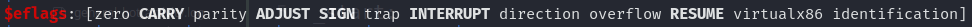
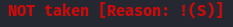
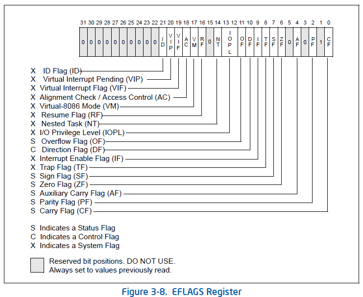

__Architettura x86-64__

# Registri:

_Nell' assembly utilizziamo i registri, piccole componenti, estramamente veloci ma che contengono pochi bytes, i quali più importanti per un utilizzo base e comprensivo sono:_

| **_Registri_** |                                 **_Descrizione_**                                 |
|:--------------:|-----------------------------------------------------------------------------------|
| rax            | Registro general purpose utilizzato per syscalls e dati  |
| rbx            | Registro general purpose utilizzato per salvare valori tra chiamate di funzioni  |
| rcx            | Registro general purpose utilizzato per immagazzinare istruzioni, dati e contatore nei loop  |
| rdx            | Registro general purpose utilizzato per immagazzinare istruzioni, syscalls, dati  |
| r8             | Registro secondario General purpose                                               |
| r9             | Registro secondario General purpose                                               |
| r10            | Registro secondario General purpose                                               |
| rsi            | Registro di origine degli operandi                                                |
| rdi            | Registro di destinazione degli operandi                                           |
| rbp            | Registro puntatore che punta all'inizio dello stack                               |
| rsp            | Registro puntatore che punta alla posizione corrente nello stack                  |
| rip            | Registro puntatore che tiene il valore all'indirizzo dell'istruzione successiva   |

> Come detto in precendenza ne esistono molti altri 

_La grandezza dei registri nel tempo è cambiato infatti dai 64 bit odierni prima avevamo:_

| **_Registro_** | **_Valore in bit_** | **_Valore in bytes_** |
|:--------------:|:-------------------:|:---------------------:|
| rax            |          64         |           8           |
| eax            |          32         |           4           |
| ax             |          16         |           2           |
| al             |          8          |           1           |


### Tipi di accessi alla memoria:

_Assembly permette diverse tipologie di accesso alla memoria:_

|             **_Tipo di Accesso_**             | **_Esempio_**            |
|-----------------------------------------------|:------------------------:|
| Immediato                                     |           add 4          |
| Tramite registro                              |          add rbx         |
| Diretto, specificando l'indirizzo di memoria  |    call 0xffffffaa83ff   |
| Indiretto, cioè utilizzando un registro       | call 0x66d020, call[rbx] |
| Stack, l'indirizzo è in cima allo stack (top) |          add rsp         |
### Endianness:

_L'endianness nell'informatica indica in che ordine vengono immagazzinati i bytes dei dati quindi:_

Indirizzo Esempio: `0x2233445566778899`

Prendendo l'indirizzo in esempio possiamo specificare che alla posizione `99` abbiamo il `Least significant byte` mente alla posizione `22` abbiamo il `Most significant byte`. 

Avendo ora fissato in mente questi due concetti possiamo spiegare che esistono due tipologie di endianness:

- __Little Endian:__ Ci riferiamo al modo di immagazzinare o recuperare i bytes che seguendo la logica del little si prendendo i byte in coppia dal primo a destra per continuare a sinistra cioè __dal least significant al most significant__ quindi risulterà `0x9988776655443322`

- __Big-Endian:__ Ci riferiamo al modo di immagazzinare o recuperare i bytes che seguendo la logica del big l'indirizzo rimarrà uguale cioè `0x2233445566778899` perchè si prendono i bytes in coppia partendo da sinistra verso destrà cioè dal __most significant byte al least significant byte___

### Data types:

_La grandenza dei dati utilizzati cambia a seconda dell'architettura però nella x86 segue quanto:_

|     **_Valore_**    | **_bits_** |    **_esempio_**   |
|---------------------|:----------:|--------------------|
| Byte                |      8     | 0xc                |
| Word                |     16     | 0xdb               |
| Dword (Double-Word) |     32     | 0x1a3fcs           |
| Qword (Quad-Word)   |     64     | 0xabcdef1234567890 |

> Una determinata grandezza in bits o byte richiede che siano utilizzati i corretti [registri](./#registri) per evitare sprechi di spazio

### Struttura di un file assembly:

_Conoscere la struttura di un file assembly è importante per avere un'idea di come funzioni il codice in se_

_Codice esempio:_
```assembly
      global  _start

      section .data

message: db   "Hello Word!"

      section .text

_start:
   mov     rax, 1
   mov     rbx, 2
   mov     rsi, message 
   add     rax, rbx
   syscall

   mov     rax, 50
   mov     rdi, 0
```


|    **_Parte Assembly_**   |                                                   **_Spiegazione_**                                                  |
|---------------------------|----------------------------------------------------------------------------------------------------------------------|
| global  _start            | **Direttiva che indica tramite la label `_start` l' inizio del codice da dove deve eseguirsi**                       |
| section .data             | **Sezione dove sono contenuto le variabili ha permessi di read and write**                                           |
| message: db "Hello Word!" | **Il `message` è una semplice etichetta, `DB` definisce il tipo di variabile e infine il contenuto: _"Hello World"** |
| section .text             | **Sezione che contiene il codice da eseguire, nella memoria è solo read only**                                       |
| _start:                   | **Parte dove inzia realmente l'esecuzione con le relative istruzioni in assembly**                                   |

_Approfondimenti:_

Nel codice di sopra possiamo notare che è stato dichiarato un `db (data bytes)` è utilizzato per dichiarare una lista di bytes, che prendono la grandezza a seconda del valore scritto ma esistono pure: 

- `dw (data words)`: dichiara una lista di words
- `dd (data digits)`: dichiara una lista di cifre
- `equ (equates)`: definisce una costante

### Assembling, linking e Disasssembling:

_I file assembly hanno estensione `.s` o `.asm`, dopo averli creati vanno assemblati e fatto il linking delle dipendenze con i seguenti commandi:_
```bash
nasm -f elf64 helloWorld.s #comando per assemblare un elf64
```
```bash
ld -o helloWorld helloWorld.o #comando per avere l'eseguibile
```
_Il dissasembling è la pratica di smontare un file ELF appena creato e verrà utilizzato objdump con i seguenti comandi:_
```bash
objdump -M intel -d helloWorld #comando per disassemblare, con -m specifichiamo la sintassi intel
```
```bash
objdump -M intel --no-show-raw-insn --no-addresses -d helloWorld #comando con cui vediamo solo il codice assembly
```
```bash
objdump -sj .data helloWorld #comando che estrae le strings dalla .data section
```

### GDB:

_GDB, acronimo di GNU Debugger, è un potente strumento di debug per programmi in C, C++ e altri linguaggi verrà utilizzato insieme a GEF_

_Comandi:_
```bash
sudo apt-get update
sudo apt-get install gdb
wget -O ~/.gdbinit-gef.py -q https://gef.blah.cat/py
echo source ~/.gdbinit-gef.py >> ~/.gdbinit #comandi per installare e settupare gdb con plugin di gef
```
```bash
help <nome comando>  #comando per aprire l'help di un comando in gdb
```
```bash
gdb -q <nome eseguibile> #comando per disassemblare un ELF
```
```bash
info functions #comando per vedere le funzioni dichiarate
```
```bash
info variables #comando per avere info sulle variabili
```
```bash
disas <nome funzione>  #comando per disassemblare la funzione
```
```bash
b <nome funzione o indirizzo di memoria> #comando per settare il breakpoint
```
`b *<nome funzione>+<offset>` metodo che setta il breakpoint partendo dalla funzione sommandolo con l'offset (l'asterisco indica il break)

ES: `b *_start+18`

`b *<indirizzo di memoria>` metodo che setta il breakpoint a uno specifico indirizzo

ES: `b *0x40130b`
```bash
registers #comando per stampare valori dei registri
```
```bash
r o run #comando per avviare il debugger
```
```bash
stepi o si / si + <num istruzioni da muoversi>> #comando per muoversi una linea per volta o aggiungendo un numero per muoversi di più istruzioni
```
```bash
step o s #comando che si muove fino alla fine
```
```bash
c o continue #comando che permette il movimento fino ad un breakpoint o alla fine del programma stesso
```
```bash
info breakpoint #commando per avere una lista e delle info sui breakpoints
```
```bash
enable/disable/delete <numero breakpoint> #comandi possibili da eseguire sui breakpoints
```
```bash
info sharedlibrary #comando per visionare le librerie importate
```
_Comandi per esaminare:_

_gdb permette di esaminare la memoria viene utilizzato il comando __x__ nella notazione `x/FMT`, in poche parole gli argomenti che prende in ordine dopo lo slash sono Count, Format e Size:_

1. Count: Indica le volte da ripetere cioè quante istruzioni o altri dati vuoi vedere

2. Format: Indica la tipologia del dato che si vuole vedere, tipo `i` per le istruzioni o `x` per i valori esadecimali

3. Size: Indica grandezza della memoria da esaminare

ES:

`x/s <indirizzo memoria>` comando per leggere una stringa

`x/7ig $rip` comando che partendo dal rip legge le prossime 7 istruzioni `(i: uguale a instruction e g: uguale a giant cioè 8 bytes)`

`x/wx` comando per esaminare valore dei registri o indirizzi

_Abbiamo inoltre il comando __print__, a differenza di `x/` che ci mostra il contenuto in memoria, print serve a mostrare il contenuto di un'espressione o di una variabile_

ES:

`p /d $rax` comando che mostrerà il contenuto di rax /d indica di mostrarlo in numero intero con segno

`p &<nome variabile>` comando per recuperare l'indirizzo di una variabile

_Comandi per modificare i valori:_ 
```bash
patch <tipo di dato o grandezza> <indirizzo di memoria> <valore> 
```
```bash
set $<registro>=<valore> #comando per modificare il valore di un registro
```
_La modifica invece di una variabile può essere svolta in due modi o reperendo l'indirizzo con il comando __"print"__ o aggiungendo la __"&"__ davanti al nome della variabile_
```bash
set {tipo}&<nome variabile> = <valore> #comando per modificare il valore di una variabile, l'indirizzo è recuperato con la &
```
```bash
print <nome variabile> #comando per recuperare indirizzo di memoria

set {tipo}<indirizzo variabile> = <valore> #comando per modificare il valore di una variabile
```
__N.B se notiamo indirizzi come 0x0000'40010 invece del solito 0xfffff'121fa è perchè nell'eseguibile è attivo il Position-Independent Executables, in cui gli indirizzi di memoria cambiano ogni volta in quanto verrà caricato casualmente.__

_Spiegazione RFLAGS:_

_GDB permette di visualizzare lo stato degli RFLAGS nel corso di un debugging infatti quando una qualsiasi flag è settata ad 1 comparirà cosi:_



_mentre a 0 sarà tutto in minuscolo._

_Specifica pure quando è impostato un jump condizionato lo stato del flag:_




### Istruzioni per il movimento dei dati:

|       **_istruzioni_**       |             **_Spiegazione_**             |                         **_Esempio_**                         |
|------------------------------|-------------------------------------------|---------------------------------------------------------------|
| MOV                          | Muove o carica un valore                  | mov rax, 4 \| rax = 4                                         |
| LEA (Load Effective Address) | Carica un'indirizzo                       | lea rax, [rsp + 6] \| rax = indirizzo rsp + 6 bytes di offset |
| XCHG                         | Muove i dati tra due registri o indirizzi | XCHG rax, rbx                                                 |

- __Moving pointer values:__

_Supponendo di avere un registro rsp con questo valore:_

$rsp   : 0x00007fffffffe490  →  0x0000000000000001 

_Possiamo vedere che contiene l'indirizzo `0x00007fffffffe490` che punta al valore `1` (puntatore), se vogliamo per qualsiasi motivo accedere a quel valore o all'indirizzo ci sono varie possibilità:_
```bash
mov rax, rsp #comando che sposta l'indirizzo che contine rsp in rax cioè 0x00007fffffffe490
```
```bash
mov rax, [rsp] #chiamato anche load value at address caricheremo in rax il valore 1, con le quadre di solito va specificato la size es word o dword ma viene fatto in automatico dal nasm
```
```bash
mov rcx, [rsp + 10] #comando che sposta di 10 byte quindi 10 indirizzi verso il basso nello stack, in questo caso stiamo facendo un'address offset
```
```bash
lea rax, [rsp] #comando che copia l'indirizzo puntato da rsp in rax
```

### Aritmetica e bitwise:

_Supponendo di avere i due registri rax e rbx con entrambi il valore di `1`:_

|**_Istruzione_** | **_Spiegazione_**                                     | **_Esempio_**       |
|------------|-------------------------------------------------|---------------|
| INC        | Incrementa di 1 il valore del registro specificato | inc rax \|  rax++    |
| DEC        | Decrementa di 1 il valore del registro specificato | dec rax  \| rax --  |
| ADD        | Aggiunge il valore del secondo registro al primo   | add rax, rbx \| rax = 1+1 = 2|
| SUB        | Sottrae il valore del secondo registro dal primo   | sub rax, rbx \| rax = 1-1 = 0|
| IMUL       | Moltiplica il primo registro per il secondo        | imul rax, rbx \| rax = 1*1 = 1|


_Ora supponiamo di avere i registri `rax = 1` e `rbx = 2`_

| **_Istruzioni_** |                   **_Spiegazione_**                   |                  **_Esempio_**                  |
|------------------|-------------------------------------------------------|-------------------------------------------------|
| not              | Inverte tutti i bit (0 diventa 1 e 1 diventa 0)       | not rax = 00000001 = 11111110                   |
| and              | Se tutti i bit sono 1 allora = 1 sennò il resto è 0   | and rax, rbx = 00000001 and 00000010 = 00000000 |
| or               | Se un bit è 1 allora il resto è 1 il resto rimane 0   | or rax, rbx = 00000001 or 00000010 = 00000011   |
| xor              | Se i bit sono uguali allora è 0 se diversi allora è 1 | xor rax, rbx = 00000001 xor 00000010 = 00000011 |

### Loop:

_I Loop sono utili per la ripetizione di un'istruzione per un certo numero di volte:_

- _Istruzioni:_
```assembly
mov rcx, 3 #comando per muovere il valore 3 nel registro rcx che farà da contatore
```
```assembly
loop <nome funzione o num indirizzo da ripetere> #comando per loopare
```

### Istruzioni di salto senza condizione e con:

_Le istruzioni di salto permettono di andare in qualsiasi punto del nostro codice che vogliamo, questi salti possono essere liberi cioè avvengono per qualsiasi circostanza oppure avvengono dopo una determinata condizione da soddisfare però prima deve essere specificata l'istruzione di `compare`:_

```assembly
CMP <primo operando>, <secondo operando>
```
- __Salto incondizionato:__

```assembly
jmp <funzione o indirizzo di memoria> #comando che serve a fare un jump incodizionato cioè che il salto avviene in ogni caso
```

- __Salto condizionato:__

|           **_Istruzioni_**          |                                                                                                                             **_Spiegazione_**                                                                                                                             |
|-------------------------------------|---------------------------------------------------------------------------------------------------------------------------------------------------------------------------------------------------------------------------------------------------------------------------|
| JZ (Jump Zero)                      | La condizione è rispettata se la zero flag (RFLAGS register) è impostato a 1 cioè il valore di un'operazione aritmetica da come risultato zero                                                                                                                            |
| JNZ (Jump Not Zero)                 | La condizione è rispettata se la zero flag (RFLAGS register) è impostato a 0 cioè il valore di un'operazione aritmetica da come risultato un numero diverso da zero                                                                                                       |
| JS (jump Sign)                      | La condizione è rispettata se la sign flag (RFLAGS register) è impostato a 1 cioè dall'operazione tra 2 registri vi è come risultato un valore negativo                                                                                                                   |
| JNS (Jump Not Sign)                 | La condizione è rispettata se la sign flag (RFLAGS register) è impostato a 0 cioè dall'operazione tra 2 registri vi  è come risultato un valore positivo                                                                                                                  |
| JG (Jump If Greater)                | La condizione è rispettata se la zero flag (RFLAGS register) è impostato a 0 cioè non ritorna un valore negativo inoltre se l'Overflow flag è impostato a 0 cioè non vi è stato overflow ed infine la sign flag deve essere 0 per indicare che la comparazione è positiva |
| JGE (Jump If Greater Than Or Equal) | La condizione è rispettata se la overflow flag e la sign flag (RFLAGS register) sono uguali con valore 0 cioè se il primo operando è maggiore o uguale del secondo                                                                                                        |
| JL (Jump If Less)                   | La condizione è rispettata se la sign flag ha valore 1 ed è diversa dalla overflow flag cioè il primo operando è minore rispetto al secondo                                                                                                                               |

_Queste sono solo alcune delle istruzioni per i salti condizionati, una lista completa è approfondita è visitabile [qui](https://www.philadelphia.edu.jo/academics/qhamarsheh/uploads/Lecture%2018%20Conditional%20Jumps%20Instructions.pdf)_

- __RFLAGS:__

Nella tabella di sopra si parla di RFLAGS, è un registro a 64 bit che assume solo il valore di 0/1 e ogni suo bit è riservato ad un flag esempio `Zero Flag (6)`, `Sign Flag (7)`, `Overflow Flag (11)`:



> Questo è l'eflag semplicemente è a 32 bit

### Stack:

_Lo stack è una struttura dati che cresce dall'alto verso il basso segue la logica del `LIFO (Last-In First-Out)` è utilizzato per salvare l'indirizzo di ritorno di una funzione,valori di un registro e ecc..._

- __PUSH e POP:__

|           **_Istruzioni_**          |                           **_Spiegazione_**                          |
|-------------------------------------|----------------------------------------------------------------------|
|push                                 | Permette di posizionare nella parte alta (Top) dello stack un valore |
|pop                                  | Permette di rimuovere un valore dalla parte alta (Top) dello stack   |


